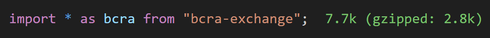
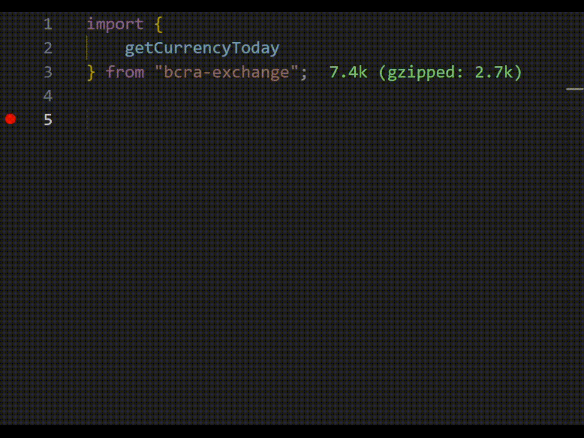

# BCRA Exchange
A lightweight fully type-safe crawler for the BCRA (Banco Central de la República Argentina) exchange rate frontend.

Easily get the exchange rate from Pesos Argentinos to any other currency and date provided by the BCRA.

> Under 3kb gzipped and no dependencies.


> Easy to use and fully type-safe.


## Installation
```bash
npm install bcra-exchange
```

## Usage
```typescript
import { getCurrencyToday , getCurrencyByDate } from 'bcra-exchange';
// or
const { getCurrencyToday , getCurrencyByDate } = require('bcra-exchange');

// Get the exchange rate from Pesos Argentinos to US Dollars
await getCurrencyToday('Dolar Estadounidense');
await getCurrencyByDate('Dolar Estadounidense', new Date('2020-01-01'));
```

This will return something like:
```json
{
    "currency": "Dolar Estadounidense",
    "dateTried": "2020-01-01T00:00:00.000Z",
    "dateFetched": "2019-12-31T00:00:00.000Z", 
    // The BCRA doesn't provide exchange rates every day
    // In this case, the closest earlier date is returned
    "value": ...
}
```


